<<<<<<< Updated upstream
Tdhis is a [Next.js](https://nextjs.org) project bootstrapped with [`create-next-app`](https://nextjs.org/docs/app/api-reference/cli/create-next-app).
=======
# Pasar AI
https://pasar-ai.vercel.app/
---
>>>>>>> Stashed changes

 Memperkenalkan sebuah website E-commerce yang menggunakan AI teknologi yang berfungsi untuk membantu seller untuk memberikan suggestion , analytic , trend Harga , market dan relater ecommerce operation.

Tidak hanya membantu seller , penggunaan AI pada web ecommerce kami juga berdampak pada buyer , dimana buyer dapat terbantu untuk mempunyai option luas dengan para seller di sekitar mereka.

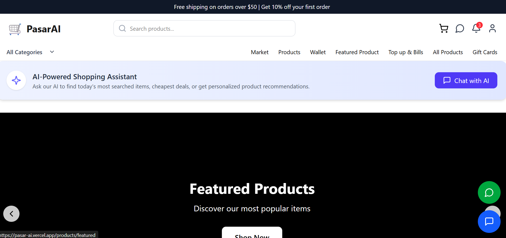

website kami menyediakan fitur listing market global , yang dimana ini bisa memberikan banyak peluang untuk para seller guna memasarkan hasil produk mereka ke ranah jual pasar global

 Selain sebagai bridging teknologi, AI dapat menjadi tools untuk aktivitass penjualan dimana Penggunaan AI dalam website kami yang berperan sebagai tools analisa dan suggestion bagi para seller . juga untuk para buyer akan sangat terbantu dengan fungsi chat yang kami sediakan untuk lebih memahami related contentnya .

 # Account

 ## Login

 Jika anda memiliki atau pernah mendaftarkan akun anda di website kami, kami sarankan untuk anda dapat login untuk  menambah pengalaman menarik anda berbelanja serta menikmati berbagai promo yang ada dan tawaran-tawaran product teratas kami 

 Untuk login silahkan anda klik ikon yang ada di paling kanan web dan klik yang paling kanan maka akan keluar tampilan seperti gambar di bawah, lalu pilih "login".

 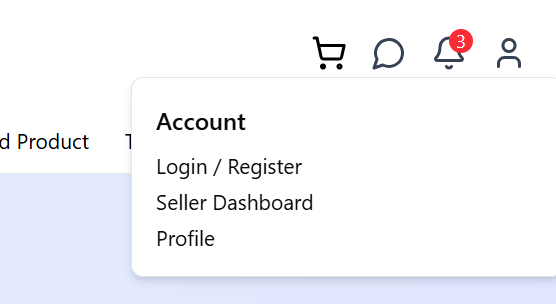
  
  

 Jika sudah maka halaman anda akan di alihkan ke halaman login / seperti gambar di bawah 
  
  
 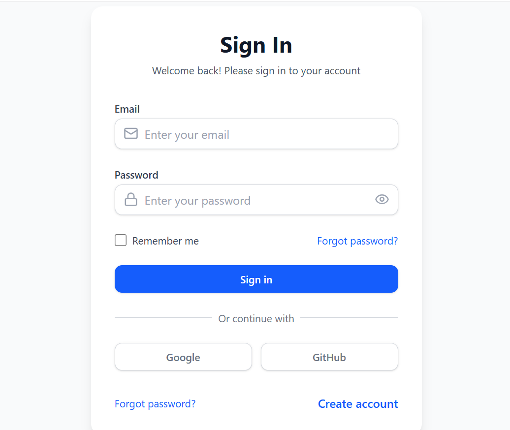
  
 Silahkan masukan email dan password yang sudah pernah anda daftarkan / anda bisa juga masuk menggunakan Google / Github anda sesuai yang sudah anda daftarkan 

## Register
Jika anda belum mendaftarkan akun anda, silahkan menuju ke home page website dan pilih menu pada ikon di bawah ini - Lalu pilih "Register"

Setelah klik pilihan Register maka anda akan menuju ke halaman Register page 

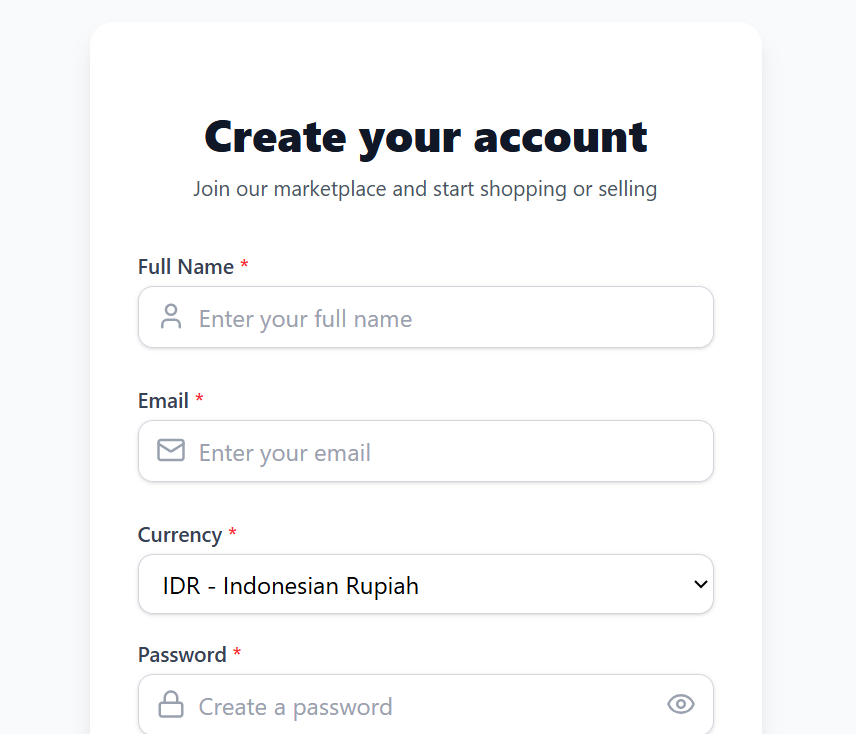

Silahkan isi sesuai dengan data pribadi anda , *Nama lengkap*, *email* dan *password* yang anda gunakan , *alamat* anda serta *nomor handphone* aktif anda yang ingin anda daftarkan.

*NOTE* : Jika anda mengisi pilihan "country" dan anda memilih Indonesia , maka "Currency" akan terubah menjadi "IDR-Indonesian Rupiah , lalu jika anda memilih selain Indonesia - maka secara otomatis Currency nya akan berubah menjadi USD/$ Amerika

Silahkan perhatikan di bagian paling bawah pad register page 

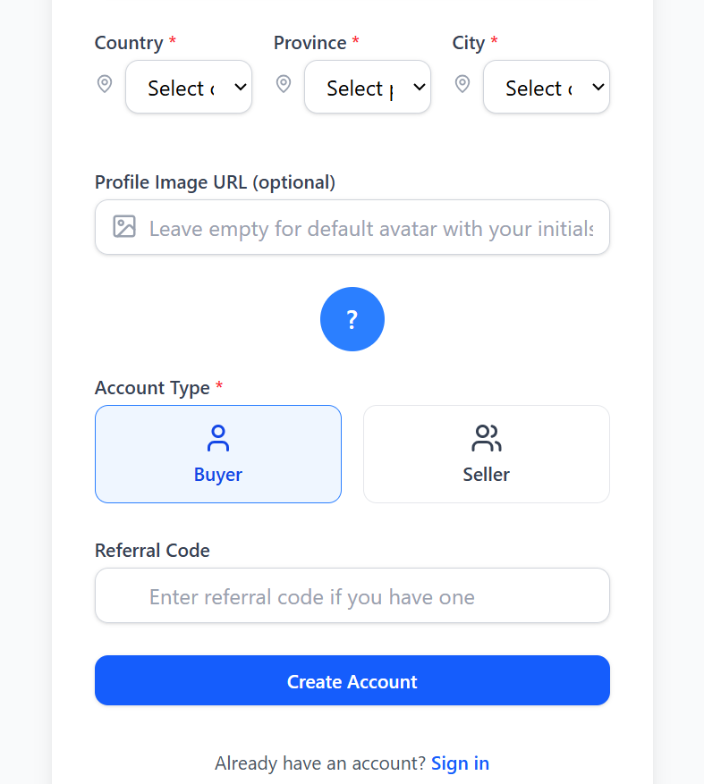
Silahkan pilih Account Type anda sesuai kebutuhan pendaftaran anda pada website kami , apakah anda ingin mendaftarkan diri sebagai "Buyer" atau anda akan menjadi "Seller" . Jika sudah anda juga dapat mengusu Referral Code jika anda memiliki 

Setelah semua sudah lengkap terisi maka klik *Create Account* dan Selamat anda sudah berhasil mendaftarkan akun anda , selanjutnya silahkan kembali ke Login page dan login dengan akun yang baru anda daftarkan .

## Dashboard
Di dalam Account page terdapat Dashboard page yang dapat membantu Seller/Buyer untuk menjangkau market yang dimana dalam dashboard page terdapat 3 sub page . 

### Market Explorer
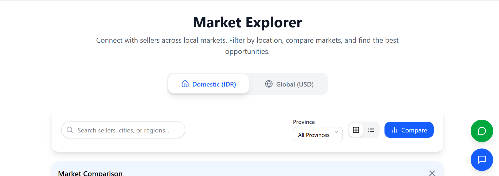
Halaman market pada Dashboard dapat membantu Seller/Buyer khususnya Seller untuk Terhubung dengan para penjual di seluruh pasar lokal maupun pasar global dengan mem-filter secara lokasi , perbandingan pasar hingga mendapat peluang terbaik 

Dan di market page terdapat market comparison yang membantu Seller untuk membandingkan antara pasar lokal dan pasar global 

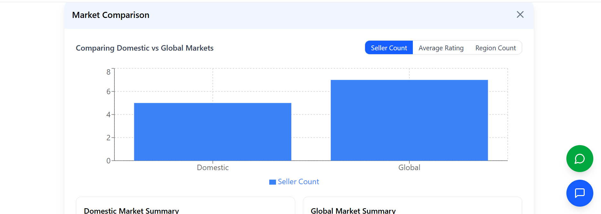

### Product Marketplace

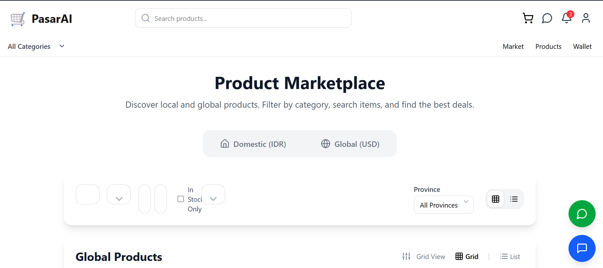

 Halaman Product Marketplace pada dashboard juga dapat membantu untuk menemukan produk lokal maupun produk global dengan memfilter berdasarkan kategori,search item, dan menemukan penawaran harga yang menarik 

 ### Wallet

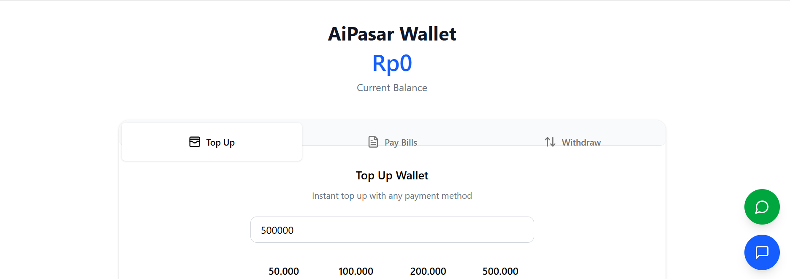
Halaman wallet pada dashboard juga membantu untuk memberi/melihat informasi Saldo yang dimiliki saat ini . Selain itu pada Halaman wallet juga dapat melakukan Top up dengan nominal yang sudah di sediakan/ sesuai kebutuhan , juga bisa melakukan pembayaran listrik,air,internet dll, dan yang terakhir ada page withdraw

Selain itu pada halaman Wallet terddapat juga transaction histori guna untuk anda memeriksa transaksi jenis apapun yang sudah anda lakukan . 

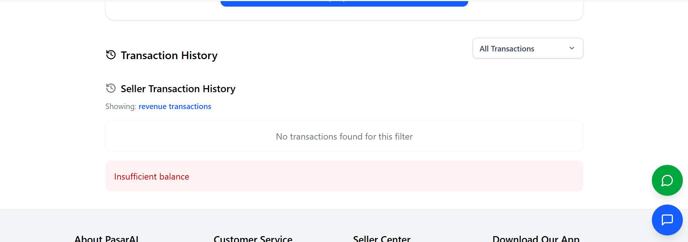
  
  

# AI-Powered Shopping Assistant
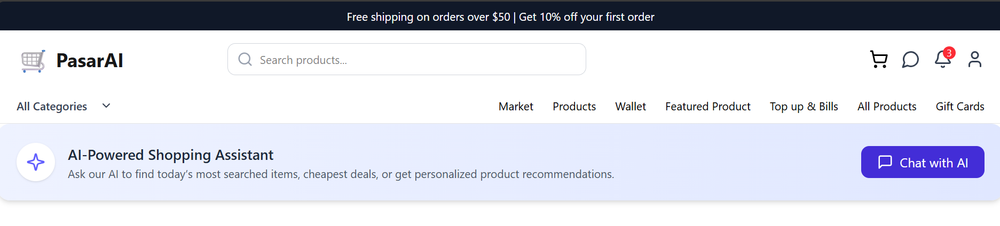

Seperti pernyataan intro di atas , website kami menggunakan teknologi AI guna untuk membantu seller untuk memberikan suggestion , analytic , trend Harga , market dan relater ecommerce operation . juga untuk buyer , dimana buyer dapat terbantu untuk mempunyai option luas dengan para seller di sekitar mereka.

Silahkan klik ikon biru (Chat with AI)
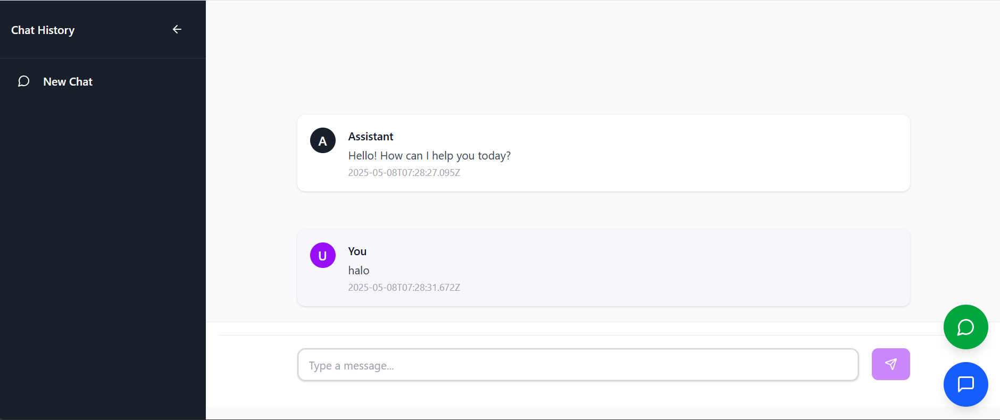
Maka halaman anda akan menjadi seperti ini.
 Anda dapat melakukan chatting apapun untuk membantu proses anda berbelanja atau hal lain yang ada butuhkan di website kami 

 # Tech Stack
 ---
 ### Back-end :
 1. Next-auth 
 2. Prisma
 3. Axios
 4. bcrypt
 5. bcryptjs

### Front-end :
1. React
2. Radix-UI
3. Axios
4. Bootstrap
5. Tailwind
6. Zustand